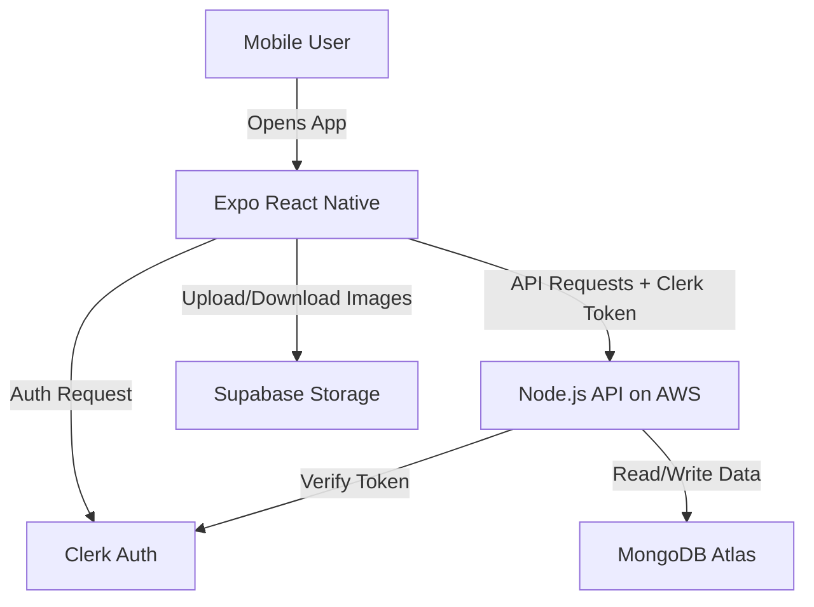

# Just Ate It

A hybrid stack - the "JustAte It" food tracker app. This repository splits responsibilities into a mobile frontend (Expo React Native) and a backend API (Node.js + Express). Auth is handled by Clerk, primary data is stored in MongoDB Atlas, and images are stored in Supabase Storage.

## High-level architecture



## What’s in this repo

- `backend/` — Node.js + Express API (expects `MONGODB_URI`, Clerk secret, etc.)
- `frontend/` — Expo React Native app (uses Clerk Expo integration and Supabase for image storage)

## Quick start (local)

1. Create the project root and subfolders if they don't exist (you may already have them from scaffolding):

```powershell
# from your workspace root
md .\justate-clone; md .\justate-clone\backend; md .\justate-clone\frontend
```

2. Backend: follow `backend/README.md` to install dependencies and run locally.
3. Frontend: follow `frontend/README.md` to install dependencies and run the Expo app.

## Environment files

- `backend/.env` should contain sensitive server keys (MongoDB connection, Clerk secret key, etc.).
- `frontend/.env` (or use environment variables in Expo) should contain public keys (Clerk publishable key, Supabase URL/anon key).

Keep secrets out of git; add `.env` to `.gitignore`.

## Next steps / Suggestions

- Implement the Expo camera "Snap It" feature and an upload flow to Supabase.
- Add sample seed data for MongoDB and basic integration tests for API endpoints.

---


=======
# Welcome to your Expo app 👋

This is an [Expo](https://expo.dev) project created with [`create-expo-app`](https://www.npmjs.com/package/create-expo-app).

## Get started

1. Install dependencies

   ```bash
   npm install
   ```

2. Start the app

   ```bash
   npx expo start
   ```

In the output, you'll find options to open the app in a

- [development build](https://docs.expo.dev/develop/development-builds/introduction/)
- [Android emulator](https://docs.expo.dev/workflow/android-studio-emulator/)
- [iOS simulator](https://docs.expo.dev/workflow/ios-simulator/)
- [Expo Go](https://expo.dev/go), a limited sandbox for trying out app development with Expo

You can start developing by editing the files inside the **app** directory. This project uses [file-based routing](https://docs.expo.dev/router/introduction).

## Get a fresh project

When you're ready, run:

```bash
npm run reset-project
```

This command will move the starter code to the **app-example** directory and create a blank **app** directory where you can start developing.

## Learn more

To learn more about developing your project with Expo, look at the following resources:

- [Expo documentation](https://docs.expo.dev/): Learn fundamentals, or go into advanced topics with our [guides](https://docs.expo.dev/guides).
- [Learn Expo tutorial](https://docs.expo.dev/tutorial/introduction/): Follow a step-by-step tutorial where you'll create a project that runs on Android, iOS, and the web.

## Join the community

Join our community of developers creating universal apps.

- [Expo on GitHub](https://github.com/expo/expo): View our open source platform and contribute.
- [Discord community](https://chat.expo.dev): Chat with Expo users and ask questions.
>>>>>>> 4dc265e (Initial commit)
